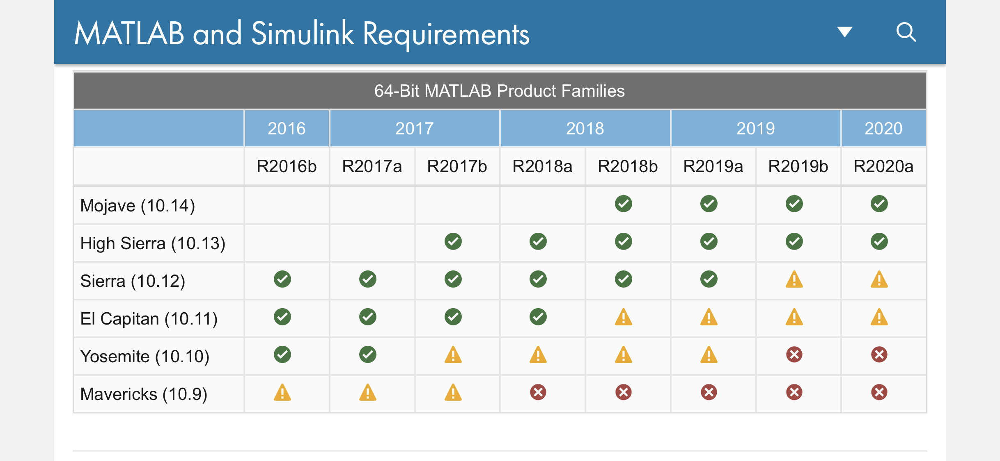

# Status of using PLDAPS/PTB on a Mac:

Running Psychtoolbox [PTB] on a Mac has been generally _"not recommended"_ for a while now  (...though fine for experimental code development, and some psychophysics applications).  See [Apple macOS section](http://psychtoolbox.org/requirements.html#apple-macos---not-recommended) of the [PTB system requirements page](http://psychtoolbox.org/requirements.html).

For better or worse, **all PLDAPS experiments should be run on Linux** machines whenever possible.
(...specifically, Ubuntu 20.04 & Matlab 2020b; see _elsewhere_ for more details)

However, there are some rig/hardware setups in the lab that are still running on Mac Pro machines. The following OS–Software versions should be used, and are expected to be the final functional versions on macOS:

## MacOS Version:

Best chance of success on macOS is likely with one of the following versions:

- 10.11 "El Capitan"
- 10.12 "Sierra"
- 10.13 "High Sierra"

Versions beyond those are increasingly unlikely to function reliably enough for experiment-grade data collection. Best to start testing with whatever [lowest compatible] version is already on the machine you intend to use.

Upgrading from one version to another can be achieved (for now) by downloading the desired installer directly from [Apple's website](https://support.apple.com/en-us/HT211683) (i.e. no longer available through standard App Store updates). 

_**Downgrading OSes is generally problematic** and should be avoided at all cost_ (...true for all OSes). You very much don't want to find yourself needing to go backwards in OS version, so advance with care.

## Matlab Version for Macs:

The official Matlab requirements page no longer goes back far enough to cover these versions of macOS, but I was able to retrieve this from the wayback machine archive (!).



Currently (spring 2021), **Matlab 2018a** looks like the safest version for running PLDAPS on an old macOS. Though it's possible code dependencies that require a newer Matlab version may arise, in which case stepping up to **2018b** or **2019a** may be necessary.

- [Older versions of Matlab](https://www.mathworks.com/downloads/web_downloads/select_release) can be downloaded from their website (...as of writing, the page only lists back to 2018b, but clicking on an older version, then editing the address to the desired even older version seems to work [for now]).
- See this [UT IT wiki page](https://wikis.utexas.edu/display/LAITS/Matlab+-+How+to+install+and+license+Matlab) if you haven't setup your utexas email with a Mathworks account. This will give you access to the unviersity-wide Matlab license. 
- The _"Campus TAH Student"_ license should be visible to all, and good enough to get anything up & running.
- ...in some cases, it is necessary to use a special _"Campus TAH Designated Computer"_ license that doesn't need to reach out to a networked license server to validate itself every so often (which can cause hiccups in experiment execution/timing). However, the Designated Computer license does [annoyingly] expire annually & usually requires intervention/assistance from department IT staff to setup/renew.

## PTB version for Macs:
Currently (spring 2021), **[the most recent PTB version](https://github.com/Psychtoolbox-3/Psychtoolbox-3)** should be functional on macs running any of the recommended macOS versions (i.e. >=10.11 & <10.14 ).

- For the most part further development & support for PTB on macOS has ended
- The PTB website does mention potential testing done on more recent macOS & Matlab versions (as recent as 10.15 "Catalina" & Matlab 2020b), but with the caveat that significant timing & functionality problems persist under those conditions, and no one should attempt/expect experiment-grade data from them.

## PLDAPS experiment code development

All that said, **there is nothing wrong with developing code on newer macOS & Matlab**

I do much of my own PLDAPS code development on:

- 2016 MacBook Pro
- macOS 11.2 "Big Sur"
- Matlab 2020b

My standard `startup.m` code spits out the following block of text in the command window whenever `ismac==true` is detected:

```matlab
!!!!!!!!!!!!!!!!!!!!!!!!!!!!!!!!!!!  WARNING  !!!!!!!!!!!!!!!!!!!!!!!!!!!!!!!!!!!
!!!	Hardware/OS with broken sync issues detected.
!!!	Execute the following code to disable sync tests & warnings:
 	Screen('Preference', 'SkipSyncTests', 2); Screen('Preference', 'Verbosity', 1);
!!!	BUT know that your stimuli won't be "research grade" with these settings!!!
!!!!!!!!!!!!!!!!!!!!!!!!!!!!!!!!!!!  WARNING  !!!!!!!!!!!!!!!!!!!!!!!!!!!!!!!!!!!
```

However, periodic testing of your new code _on a Linux machine at the actual experimental rig is **strongly recommended.**_ Otherwise when timing issues arise, you won't have a clue how far back the culprit may be.

